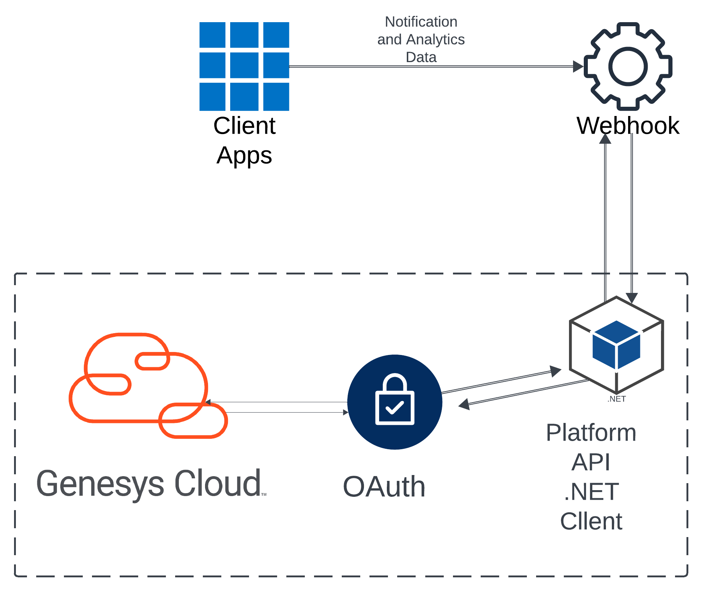
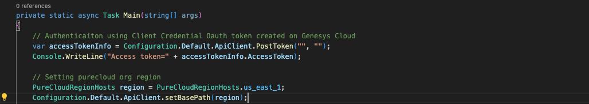
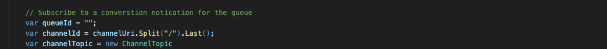

This project leverages the Genesys Platform API .NET Client SDK, a key component of Genesys Developer Tools, to demonstrate how to integrate OAuth Client Credential authentication for secure access.



In the first part, we utilize the Analytics API library to query voice conversation metrics, extracting insights such as:

- Number of connected interactions
- Number of transferred interactions
- Number of abandoned interactions

In the second part, we implement the Notifications API library to establish a WebSocket-based notification channel. This setup enables real-time queue observation query, allowing continuous monitoring of key interaction metrics such as:

- Observed number of interactions waiting in a queue.
- Observed number of users with a particular routing status.
- Observed number of current users interacting on a queue.

## Solution components

- **Genesys Cloud**: A platform for enterprise-grade communication, collaboration, and contact center management.
- **Genesys Cloud .NET SDK**: A powerful tool to interact with Genesys Cloud APIs using .NET.
- **WebSocket Technology**: Provides real-time updates for ongoing queue interactions.
- **Queue Notifications**: The subscription mechanism for receiving updates on specific queue events.

## Prerequisites

### Specialized Knowledge
- Familiarity with Genesys Cloud APIs and .NET SDK.
- Basic understanding of WebSocket technology and real-time data streaming.
- Experience with C# programming.

### Genesys Cloud Account
- A Genesys Cloud CX 1 license. For details, see [Genesys Cloud Pricing](https://www.genesys.com/pricing).
- The Master Admin role in Genesys Cloud for accessing the necessary APIs.

## Sample Console .NET Application
This solution includes a sample .NET app that uses the Genesys Cloud .NET Platform SDK

### Run the sample console .NET app locally

1. Clone the [blueprint repo](https://github.com/GenesysCloudBlueprints/genesys-cloud-dotnet-sdk-analytics-api) to your local machine

```bash
git clone git@github.com:GenesysCloudBlueprints/genesys-cloud-dotnet-sdk-analytics-api.git
```

2. Go to **genesys-cloud-dotnet-sdk-analytics-intergration** project directory

```bash
cd genesys-cloud-dotnet-sdk-analytics-intergration
```

3. Enter the empty string with Genesys Cloud client ID and client secret values in the Program file

```dotnet
var accessTokenInfo = Configuration.Default.ApiClient.PostToken("", "");
```

4. Modify the region to your Genesys region

```dotnet
PureCloudRegionHosts region = PureCloudRegionHosts.us_east_1;
```

5. Enter queue Id to empty string

```dotnet
var queueId = "";
```

6. Run and Debug

7. Make an ACD call to your Genesys Cloud org and see interaction details in terminal

## Implementation Steps

### 1. Install Platform API Client SDK - .NET
The first step involves installing Genesys Cloud .NET SDK. For more information visit [Platform API .NET Client](https://mypurecloud.github.io/platform-client-sdk-dotnet/)

```bash
dotnet add package PureCloudPlatform.Client.V2 --version 226.0.0
```

### 2. OAuth Authentication Set up on Genesys Cloud
* This step involves setting up Client Credential Grant on Genesys Cloud
    - Go to Admin tab on Genesys Cloud and Select 0Auth option under Integration
    - Select the Add Client button
    - Enter App Name and select Client Credentials option
    - Select the Roles tab and toggle on the admin Default role
    - Save
* Import these Libraries below on your Program file to authenticate with Cient Id and Client Secret
    `using PureCloudPlatform.Client.V2.Api;`
    `using PureCloudPlatform.Client.V2.Client;`
    `using PureCloudPlatform.Client.V2.Extensions;`

* Input your ClientId and Client Secret to authenticate. Also set your Org region, example: us_east_1


* Input QueueId 


### 3. Query voice conversation metrics from Genesys Cloud Analytics API
* Create Analytics Conversation Object
  - Defines a filter for mediaType = "voice"
  - Sets a time interval
  - Groups results by Queue ID and User ID
  - Retrieves connected, transferred, and abandoned calls

  ```dotnet
  var predicate = new ConversationAggregateQueryPredicate
  {
      Dimension = ConversationAggregateQueryPredicate.DimensionEnum.Mediatype,
      Value = "voice"
  };

  var filter = new ConversationAggregateQueryFilter
  {
      Type = ConversationAggregateQueryFilter.TypeEnum.And,
      Predicates = new List<ConversationAggregateQueryPredicate> { predicate }
  };

  var query = new ConversationAggregationQuery
  {
      Interval = "2024-11-18T13:00:00.000Z/2025-01-25T13:00:00.000Z",
      Granularity = "PT12H",
      GroupBy = new List<ConversationAggregationQuery.GroupByEnum>
      {
          ConversationAggregationQuery.GroupByEnum.Queueid,
          ConversationAggregationQuery.GroupByEnum.Userid
      },
      Metrics = new List<ConversationAggregationQuery.MetricsEnum>
      {
          ConversationAggregationQuery.MetricsEnum.Nconnected,
          ConversationAggregationQuery.MetricsEnum.Ntransferred,
          ConversationAggregationQuery.MetricsEnum.Tabandon
      },
      Filter = filter
  };

* Query Analytics Conversation API

```dotnet
var analyticsApi = new AnalyticsApi();
var conversationAnalyticsAggregate = new AnalyticsConversationsAggregates(analyticsApi);
conversationAnalyticsAggregate.PostAnalyticsConversationsAggregates();
```

## Additional Resources
* Genesys Cloud Notification API [Notification Service](https://developer.genesys.cloud/notificationsalerts/notifications/)
* Genesys Cloud Analytics API [Analytics](https://developer.genesys.cloud/analyticsdatamanagement/analytics/)
* Analytics Metrics: [Metrics](https://developer.genesys.cloud/analyticsdatamanagement/analytics/metrics)


